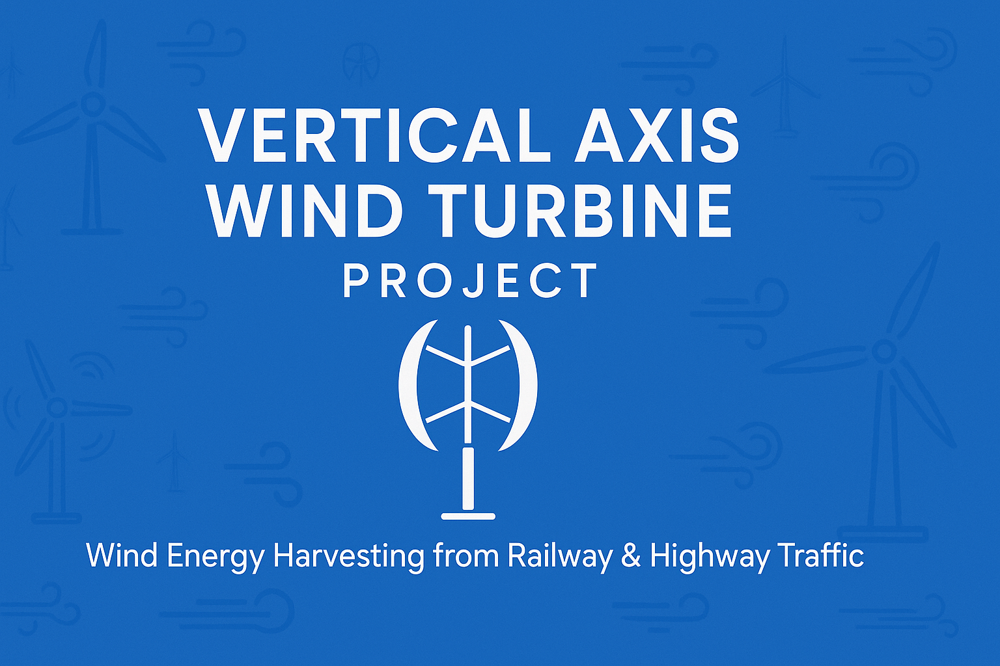
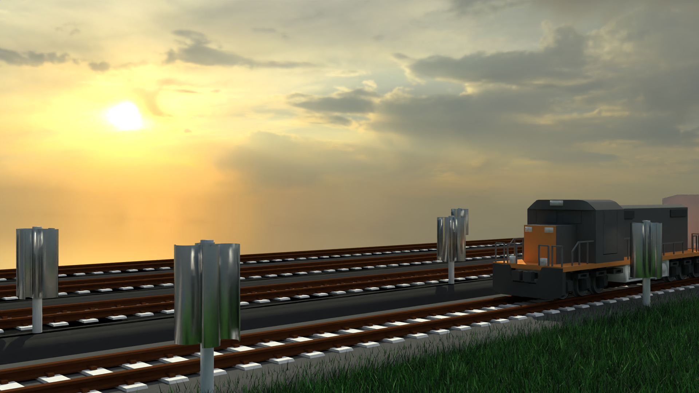
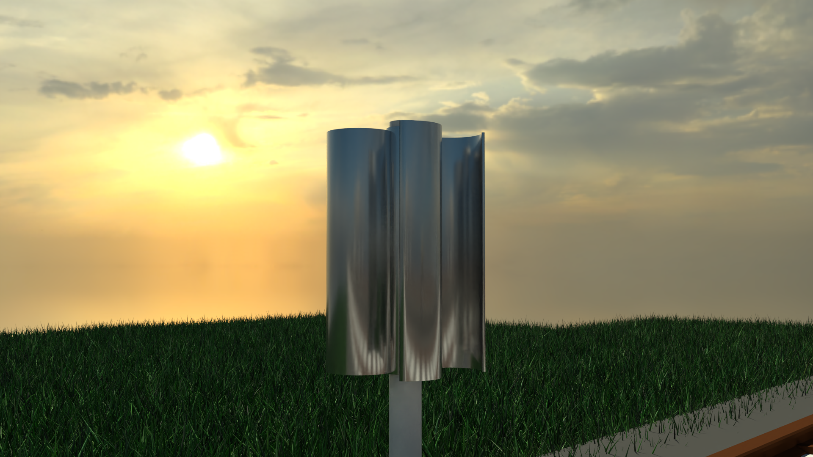

# 🌬️ Vertical Axis Wind Turbine for Railway & Highway Wind Energy Harvesting
> A Research project by **Aniket Singh**  
> Exploring the potential of Wind energy as a clean, renewable power source  
> 📍 Presented as a working concept at **Mini Avishkar Competition**, **KET's V. G. Vaze College** 
> 📅 Date: 14th February 2023

 

 <!-- Replace with your banner image if available -->

## 📌 Project Overview

The **Vertical Axis Wind Turbine (VAWT)** project is an innovative solution to harness wind energy generated by fast-moving trains and highway traffic. By installing vertical axis turbines alongside rail tracks and roads, this system can effectively convert kinetic wind energy into electricity — offering a sustainable power alternative for public infrastructure.

---

## 🏆 Awards & Recognition

🥇 **1st Prize Winner** at **Mini Avishkar Competition**, KET's V. G. Vaze College  
📅 **Date: 14th February 2023**
 
Presented as a working concept with a handmade poster and animated demo, this project was recognized for its innovation, impact, and feasibility in real-world application.

## What is Avishkar ?
[▶ About Avishkar](Avishkar%202023.pptx)
---

<!--
🏆 Awards & Recognition
🥇 1st Prize Winner at Mini Avishkar Competition, KET's V. G. Vaze College
📅 Date: 14th February 2023
Presented with a handmade poster and animated demo, this project was recognized for its innovation, impact, and feasibility in real-world application.-->
---

## 🎯 Objectives

- Harvest wind energy from the turbulence caused by fast-moving trains and vehicles.
- Reduce reliance on conventional energy sources by powering station systems and street lighting.
- Promote sustainable, renewable energy innovations in transportation infrastructure.
- Enable scalable implementation across urban and rural corridors.

---

## 🚀 Key Features

- ✅ **Innovative Application**: Converts unused wind energy from train motion into electricity.
- ✅ **Vertical Axis Design**: Efficient for all wind directions, ideal for roadside and trackside setups.
- ✅ **Eco-Friendly**: Zero emissions and low maintenance.
- ✅ **Scalable & Cost-Effective**: Can be deployed in multiples for increased energy output.
- ✅ **Highway Compatible**: Not limited to railway — works on roads with heavy traffic too.

---

## 🎥 Media & Demonstrations

- 🖼️ **Handmade Poster**: Illustrated design showing turbine design, working, statistics, Limitations etc.
- 🎞️ **3D Animated Video**: Demonstrates how the turbine spins using wind from a passing train.

| 🧾 Poster |
|--------------------|
|  |

Turbine WireFrame |  Turbine ViewPort | Turbine Model
:-------------------------:|:------------------------:|:-------------------------:
 |   |  

Final Model WireFrame | Final Model ViewPort |
:-------------------------:|:------------------------:|
 |  |
<!--

| Final Model ViewPort |
|:------------------------:|
|   |
-->

| Final VAWT Animation |
|:------------------------:|
|   |

---

## 🧰 Tools & Technologies

- 💡 Vertical Axis Wind Turbine (VAWT) design
- ✍️ Handmade sketching for concept illustration
- 🛠 Blender & After Effects for animation
- ⚙️ Basic mechanical & environmental engineering principles

---

## 🌱 Future Scope

- Powering smart lights, IoT sensors, and signboards near railways/highways.
- Pilot installations in metro cities under smart city missions.
- Integration with battery banks for off-grid storage.
- Expansion to airport runways or industrial corridors.

---

## 🎥 Demo Video
[▶ Watch Demo Video](ModelDemoAnimation.mp4)
---
---
## 🖼️ Preview Models

| 🧾 VAWT Demo |
|--------------------|
|  |

| 🧾 Turbine Model |
|--------------------|
|  |
